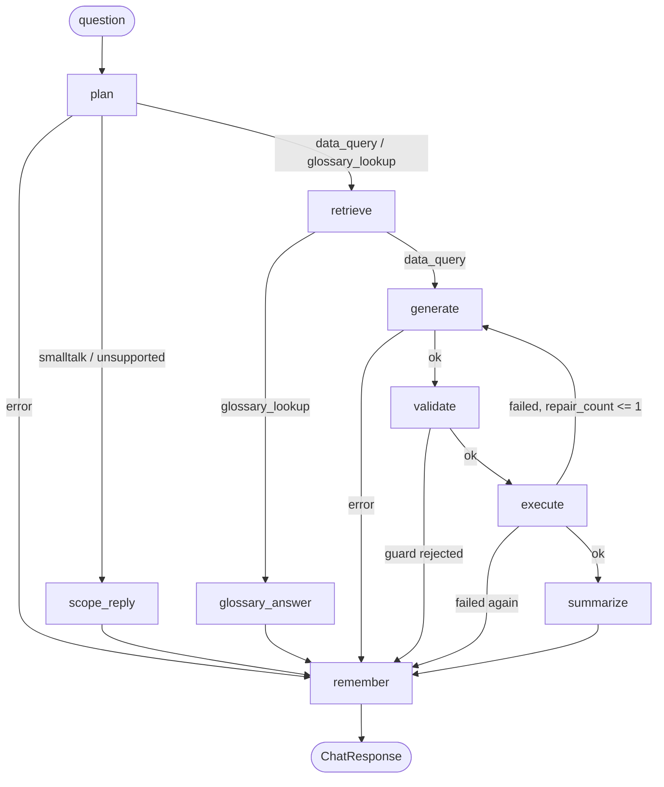

# How the code flows

What actually executes, in order, with file and line references. Written so someone who
has never opened this repo can follow a single question from a browser click to a
Snowflake result and back.

**Maintenance:** update this in the same commit as any change that adds or removes a hop
— a new endpoint, a new graph node or edge, a changed call chain, a new defense layer.
Keep the `file:line` references accurate; a stale line number is worse than none. See
[DECISIONS.md](DECISIONS.md) for *why* each of these things is the way it is.

*Verified against the tree at commit `61e713b`. Line numbers reflect that commit.*

---

## Orientation: what runs where

| Piece | Entry point | Process |
|---|---|---|
| React SPA | `frontend/src/main.tsx:1-9` | Browser |
| FastAPI backend | `backend/src/copilot/api/main.py:55` (`app`) | uvicorn |
| MCP tool server | `mcp_server/server.py` | Child process of the backend, over stdio |
| Warehouse build | `warehouse/load_bronze.py`, dbt, `warehouse/load_ai_library.py` | One-off CLI |
| Seed data | `data/seed/generate.py:119` | One-off CLI |

The MCP server is not a separate service. The backend spawns it as a subprocess and talks
to it over stdio, so "four pieces" is about responsibility, not deployment.

---

## 1. Backend startup

**Nothing is built at import time.** Dependencies are constructed on the first request that
needs them, which keeps the module importable in tests without credentials.

### 1.1 Lifespan gate — `api/main.py:30-52`

Runs once before the app serves traffic:

1. `main.py:34` reads `get_settings().jwt_secret` (imported inside the function so importing
   `main` never eagerly builds `Settings`).
2. `main.py:35-42` — if the secret is still the published default `"dev-secret-change-me"`,
   raise `RuntimeError` and **refuse to start**.
3. `main.py:43-48` — if the secret is shorter than 32 bytes, refuse likewise.
4. `main.py:49` — `yield`; the app serves.
5. `main.py:50-52` — on shutdown, close `app.state.executor` if one was ever built.

The gate exists because the JWT's `role` claim selects the Snowflake session, so forging a
token is privilege escalation. A weak or public signing key is not a misconfiguration to
warn about — it is a reason not to run.

### 1.2 Dependency construction — `api/main.py:86-123`

`_deps()` is called by every request handler:

1. `main.py:104` — fast path: if `app.state.provider` exists, return immediately, no lock.
2. `main.py:106-108` — take `_deps_lock` (`main.py:83`), then re-check inside the lock
   (double-checked locking; a thread that lost the race returns the built state).
3. `main.py:113-117` — build **into locals**, in order: `AnthropicProvider()`, then
   `SnowflakeClient` for `COPILOT_APP_RO`, `COPILOT_ADMIN`, and `COPILOT_APP_WRITER`, then
   the MCP executor if `use_mcp`.
4. `main.py:118-122` — only once all five succeed, publish all of them to `app.state`.

Publishing last is load-bearing. An earlier version set `app.state.provider` first, and
because sync endpoints run in FastAPI's threadpool, concurrent first requests read
half-initialised state — measured at seven of eight returning 500.

A Snowflake client failure propagates (a 500 on that request, retried cleanly next time).
Only the MCP executor is allowed to fail softly: `_build_executor` (`main.py:132-143`)
catches any exception, logs with a traceback, and returns `None` so the app degrades to
direct execution rather than refusing to answer.

### 1.3 MCP recovery — `api/main.py:146-171`

`_live_executor(state)` runs on every chat request:

- `main.py:156-158` — `None` executor (disabled or failed at startup) → return `None`.
- `main.py:159-161` — healthy executor → return it unchanged.
- `main.py:162-171` — broken → under the lock, re-check nobody else already replaced it,
  best-effort `close()`, rebuild with a **15-second** timeout (`_MCP_REBUILD_READY_TIMEOUT`,
  `main.py:129`) rather than the 60-second cold-start budget, and republish.

Without this, a dead subprocess stayed on `app.state` forever and every request blocked on
it twice — once normally, once through the repair edge.

---

## 2. One chat request, end to end

`POST /api/chat` → `main.py:259`.

1. **Authenticate** — `_require_identity` (`main.py:207-224`). Reads the `Authorization`
   header (`main.py:217-219`); missing or non-`Bearer` → 401. Decodes **once** via
   `auth.decode_token` (`auth.py:39-43`, `algorithms=["HS256"]`), returns
   `(payload["role"], payload["sub"])`. Catches `AuthError` **and** `KeyError` together
   (`main.py:223-224`) so a validly-signed token missing a claim is a 401, not a 500.
2. **Validate input** — empty question → 400 (`main.py:248-249`). A `conversation_id`
   containing `:` → 400 (`main.py:255-256`), because `:` separates the checkpointer's
   thread key and must stay unambiguous.
3. **Build dependencies** — `_deps()` (`main.py:257`).
4. **Pick the retrieval session** — `main.py:258`:
   `sf = state.sf_admin if role == "admin" else state.sf_ro`.
5. **Pick the execution role** — `main.py:267`:
   `sf_role = "COPILOT_ADMIN" if role == "admin" else "COPILOT_APP_RO"`. Derived only from
   the verified token, fail-closed to the masked role. Masking CASEs on `CURRENT_ROLE()`,
   so the role must follow the query all the way to execution, not just retrieval.
6. **Get a live executor** — `_live_executor(state)` (`main.py:272`), then bind the role
   onto it with `functools.partial` (`main.py:273-274`) so the graph still sees the
   `(sql) -> (columns, rows)` shape it expects.
7. **Namespace the conversation** — `_scoped_conversation_id(email, id)`
   (`main.py:184-192`) returns `f"{email}:{conversation_id}"`, or `None` if the client sent
   none. `None` stays `None`: an anonymous turn gets no memory and mints no checkpoint.
8. **Run the agent** — `answer_question(...)` (`main.py:282-283` → `pipeline.py:26`).
9. **Log the request** — `log_request(...)` (`main.py:284-287`). The logged conversation id
   comes from `_logged_conversation_id` (`main.py:195-204`), which is *always*
   identity-scoped and never `None` — `REQUEST_LOG` has no user column, so without this an
   audit row cannot name its actor.
10. **Return** the `ChatResponse` (`main.py:288`).

`POST /api/feedback` (`main.py:304-318`) follows the same auth path, validates the rating,
and writes via `sf_writer`. Unlike request logging, a feedback write failure **is**
surfaced — 503 (`main.py:316-317`) — because the user is owed the truth about whether their
feedback was recorded.

---

## 3. The agent graph

Built by `build_graph(provider, sf, executor=None, use_memory=True)` — `graph.py:54-200`.

`graph.py:58` picks the executor with an explicit `is not None` check, never a truthy
`or`, so a valid-but-falsy executor object can never silently fall back to direct
Snowflake and bypass the MCP layer.



### Nodes

| Node | Lines | Reads | Writes | On failure |
|---|---|---|---|---|
| `plan` | `graph.py:60-71` | `question`, `history` | `intent`, tokens | `error_type="llm"` |
| `scope_reply` | `graph.py:73-76` | `intent` | `answer` | — |
| `retrieve` | `graph.py:78-81` | `question` | `context`, `retrieval_ms`, `retrieval_mode` | propagates (see §5) |
| `glossary_answer` | `graph.py:83-96` | `context`, `question` | `answer`, tokens | `error_type="llm"` |
| `generate` | `graph.py:98-114` | `context`, `question`, `history`, `exec_error`, `draft_sql` | `draft_sql`, `assumptions`, tokens | `error_type="llm"` |
| `validate` | `graph.py:116-125` | `draft_sql` | `safe_sql` | `error_type="validation"` |
| `execute` | `graph.py:127-134` | `safe_sql` | `columns`, `rows` | `exec_error`, `repair_count += 1` |
| `summarize` | `graph.py:136-149` | `question`, `safe_sql`, `rows` | `answer`, tokens | `error_type="llm"`, **keeps the data** |
| `remember` | `graph.py:151-161` | `history`, `answer` | `history` | — |

Every LLM-calling node catches broadly and converts to state. None of them raise.

### The repair edge — `graph.py:188-192`

```python
lambda s: "repair" if s.get("exec_error") and s.get("repair_count", 0) <= 1
          else ("failed" if s.get("exec_error") else "ok")
```

`execute` increments `repair_count` on each failure, so: first failure → count 1 → `1 <= 1`
→ back to `generate` with the error text appended (`graph.py:101-103`). Second failure →
count 2 → `"failed"` → `remember`. **Exactly one retry; at most two executions per turn.**

A guard rejection deliberately does *not* repair (`graph.py:116-125`) — repair is for
execution errors. It also keeps the rejected `draft_sql`, tokens, intent, and
`retrieval_ms` in state, so the audit row records what was attempted instead of nulls.

### Memory — `graph.py:15-18`, `197-200`, `checkpointer.py`

`_CHECKPOINTER` is a module-level `BoundedInMemorySaver` (`graph.py:18`), process-global and
keyed by `thread_id` — the identity-namespaced conversation id from §2 step 7. It is
attached only when `use_memory` is true (`graph.py:197-200`), which happens only when the
caller supplied a conversation id (`pipeline.py:31`).

`BoundedInMemorySaver` (`agent/checkpointer.py`) subclasses LangGraph's `InMemorySaver` and
overrides `put` (`agent/checkpointer.py:51-58`) to enforce two caps: `MAX_THREADS = 64` with LRU
eviction (`agent/checkpointer.py:60-68`) and `MAX_CHECKPOINTS_PER_THREAD = 24`
(`agent/checkpointer.py:70-97`), pruning old checkpoints, their writes, and any orphaned blobs.
Blobs hold the actual result rows, which is the point: a plain `InMemorySaver` retains
~9 checkpoints per turn, each a full copy of the channel values — measured at ~90 KB per
turn, never freed, with an admin's *unmasked* rows sitting in process memory indefinitely.

`remember` (`graph.py:151-161`) appends `(question, answer[:500])` and truncates to the last
6 turns; the prompt builder uses the last 3. When a turn produced no answer it records
`[failed: ...]` (`graph.py:155-159`) so the next prompt does not contain a blank `A:`.

### State → response — `pipeline.py:26-98`

1. `pipeline.py:30` — mint `request_id` first, so even a total failure is attributable.
2. `pipeline.py:33-47` — import and build the graph *inside* the try, then `invoke`.
3. `pipeline.py:48-62` — three catches. The reachable one is `except Exception`
   (`pipeline.py:58-62`) → `error_type="snowflake"`; it catches a retrieval outage
   propagating out of the `retrieve` node (§5) and any LangGraph-internal failure. The
   `except SqlGuardError` and `except ValueError` handlers above it are defensive: every
   node already converts those to state, so no current path reaches them.
4. `pipeline.py:63-98` — response construction is *itself* wrapped, because Pydantic's
   `ValidationError` subclasses `ValueError` and would otherwise escape the never-raises
   contract. This cannot fire today; wrapping makes the contract structural rather than
   incidental.
5. `pipeline.py:74-82` — if `exec_error` is set **and** no node classified the error, report
   `"snowflake"`. The `and not error_type` guard matters: without it, a stale `exec_error`
   from the first attempt overrode a repair-cycle node's correct `"llm"` or `"validation"`
   classification.
6. `pipeline.py:83-94` — `sql`, `columns`, `rows`, and `assumptions` are populated only when
   `intent == "data_query"`; rows are truncated to 200.

---

## 4. The three SQL defense layers

### Layer 1 — `sql_guard.validate(sql)`, `sql_guard.py:77-128`

In order:

1. `78-81` — parse with sqlglot (`read="snowflake"`); a parse error is a rejection.
2. `82-84` — exactly one statement, or reject. Blocks stacked queries.
3. `85-88` — must be a `Select` or set operation.
4. `89-90` — reject `SELECT ... INTO` (it emits `CREATE TABLE`).
5. `91-103` — walk every node and reject: anything in `BANNED` (`sql_guard.py:15-17` —
   `Insert, Update, Delete, Drop, Create, Alter, Merge, TruncateTable, Command, Grant,
   Into`); denied functions via `_is_denied_function` (`43-57`) — `GET_DDL` and any
   `SYSTEM$*`; `TableFromRows`; `Lateral`; and `Dot` nodes wrapping a function call.
6. `104-118` — table allowlisting. CTE names are collected first and allowed unqualified;
   a function used as a table is rejected; the catalog must be in `ALLOWED_DBS`
   (`{"", "MEDTECH_ANALYTICS"}`); the schema must be in **`ALLOWED_SCHEMAS = {"GOLD"}`**
   (`sql_guard.py:13`). `_ident_value` (`36-40`) preserves case for quoted identifiers and
   upper-cases bare ones, matching Snowflake's own rules — which is what closes the
   `"gold"` case-folding bypass.
7. `119-127` — `LIMIT` clamping: an integer literal in `[1, 1000]` is kept; anything else
   (including `NULL`, a huge literal, or no limit at all) is replaced with `LIMIT 1000`.
8. `128` — return the **re-serialized** SQL. This is what executes.

The denied-function check runs on the parsed tree, not the source text, because the
parse-and-regenerate round trip rewrites the SQL: `GET_DDL/*x*/('TABLE','...')` does not
match a regex but comes out of sqlglot as a clean, callable `GET_DDL(...)`. `_is_denied_function`
also closes the quoted-identifier variant `"GET_DDL"(...)`, and produces no false
positives on string literals that merely contain the text.

`deny_side_effects(sql)` (`sql_guard.py:60-74`) exposes only that check, so layer 2 can
re-run the identical logic instead of maintaining a copy that drifts.

### Layer 2 — `mcp_server/server.py`

`_run_query_impl` (`server.py:97-104`):

1. `99` — re-run the **full** `validate()`. The server is reachable by any MCP client, not
   just this app, so it trusts nothing.
2. `100-101` — a guard rejection becomes `ValueError("rejected by SQL guard: ...")`.
3. `102` — `_deny_side_effects(safe)` on the already-validated SQL, guarding against
   anything the re-serialization step could have introduced.
4. `103-104` — execute, cap rows at 1000 independently of the SQL `LIMIT`.

`_sf(role)` (`server.py:60-79`) rejects any role outside
`_ALLOWED_ROLES = {"COPILOT_APP_RO", "COPILOT_ADMIN"}` (`server.py:29`) before constructing
a client — the backstop for §2 step 5, so even a buggy or hostile client cannot open an
arbitrary Snowflake session. Clients are cached one per allowlisted role.

The other three tools (`list_tables` `server.py:125-130`, `describe_table` `133-136`,
`search_glossary` `139-144`) run fixed, app-authored, parameterized SQL and never touch the
guard, because no LLM output reaches them.

### Layer 3 — `warehouse/bootstrap.sql`

- `20-25` — three roles; `COPILOT_APP_RO` and `COPILOT_APP_WRITER` are granted to
  `COPILOT_ADMIN`.
- `34-40` — `COPILOT_APP_RO` gets `SELECT` on all current and future GOLD tables and views.
  BRONZE and SILVER are never granted, so raw data is unreachable regardless of the guard.
- `42-65` — the COPILOT schema is deliberately **not** granted schema-wide: `51-52` revoke
  any pre-existing `ALL`/`FUTURE TABLES` grant, and `64-65` grant `SELECT` on exactly
  `SCHEMA_CARDS` and `GLOSSARY`. This is what keeps `REQUEST_LOG`, `FEEDBACK`, and
  `EVAL_RESULTS` unreadable by the analyst role even if layers 1 and 2 were bypassed.
- `86-96` — `COPILOT_APP_WRITER` gets `INSERT` only, never `SELECT`. `COPILOT_ADMIN` gets an
  **explicit** `SELECT` on the COPILOT schema rather than inheriting it, because the
  inherited path was removed by the revoke above.
- `8-12` — `STATEMENT_TIMEOUT_IN_SECONDS = 60` on the warehouse, matching the client's
  60-second call timeout, so an abandoned query cannot outlive the request that gave up on it.
- `99-109` — `COPILOT_SVC` is `TYPE = SERVICE` with key-pair auth and
  `DEFAULT_SECONDARY_ROLES = ()`.

**Who catches what.** Layers 1 and 2 enforce the same rules on SQL text, in-process and
then again at the tool boundary. The role allowlist is layer 2 only — layer 1 has no
concept of a role. Layer 3 is the only one Snowflake itself enforces, and the only one that
still holds if a future code path calls `sf.run_query` without going through the guard.

---

## 5. Retrieval — `retrieval.py:40-69`

1. `43-57` — **vector path.** Two parameterized queries ordered by
   `VECTOR_COSINE_SIMILARITY(embedding, SNOWFLAKE.CORTEX.EMBED_TEXT_768(...))`
   (`retrieval.py:10`): top `k_cards` schema cards and top `k_terms` glossary entries.
   `mode` stays `"vector"`.
2. `58-67` — **keyword fallback.** Any exception (Cortex unavailable, region without the
   function, warehouse hiccup) logs a warning with a traceback, re-reads both tables
   without the vector clause, and ranks with `_keyword_fallback` (`24-37`) — question words
   longer than three characters, scored by occurrence. Sets `mode="keyword"` explicitly.
3. `68-69` — stamp `retrieval_ms` and return.

`retrieve()` does not raise for a Cortex failure. It *can* raise if the fallback's plain
`SELECT`s also fail — a total warehouse outage — and the `retrieve` node has no try/except
(`graph.py:78-81`), so that propagates out of `graph.invoke` into `pipeline.py:58-62` and
becomes `error_type="snowflake"`. That is the reachable path for the outer catch-all.

`mode` reaches the client as `ChatResponse.retrieval_mode`, so a silent degradation to
keyword ranking is visible rather than invisible.

---

## 6. MCP round trip — `mcp_client.py`

The SDK is async; FastAPI's sync endpoints run in a threadpool. `McpExecutor` bridges them.

1. `88-108` — `__init__` creates a **new event loop**, a `threading.Event`, and a daemon
   thread running `_run_loop`.
2. `109-114` — the constructor blocks on `_ready.wait(ready_timeout)` (60s default, 15s for
   a mid-request rebuild). Timeout or startup error → `_abort_startup()` and `McpError`.
3. `116-133` — `_run_loop` owns the loop and runs `_main()` to completion. Its `finally`
   clears `_session`, sets `_dead`, and sets `_ready` — so a caller waiting on startup
   always unblocks, even on failure.
4. `135-170` — `_main()` is a single coroutine owning the whole session lifetime, because
   `stdio_client` and `ClientSession` are async context managers whose `__aenter__` and
   `__aexit__` must run in the same Task. It spawns the subprocess with `sys.executable`
   and the **full parent environment** (`142-151`) so variables like
   `COPILOT_FAKE_SNOWFLAKE` reach the child, initializes the session, publishes it, signals
   ready, then parks on `_stop_event`.
5. `201-209` — `is_broken()` is true if the loop exited, the caller closed it, a transport
   failure was flagged, or the session is gone.
6. `247-266` — `run_query(sql, role=...)` submits `call_tool` via
   `asyncio.run_coroutine_threadsafe` (`224-227`) and polls the future in 50 ms slices
   (`228-245`). It fails fast in three ways: already broken → immediate `McpError`
   (`219-222`); the loop dies mid-flight → cancel and raise without waiting out the timeout;
   the 60-second budget elapses → cancel and raise. A non-`McpError` escaping `call_tool` is
   treated as transport-level, marks the executor broken, and is re-raised as `McpError`.
7. `26-66` — `_parse_tool_result` normalizes real SDK objects and test doubles, unwraps
   FastMCP's `{"result": ...}` envelope (`56-57`), and converts every shape or JSON error
   into `McpError`, so the repair loop never sees a raw parser traceback.
8. `268-283` — `close()` is idempotent, signals the stop event, joins the thread, and closes
   the loop.

The polling design exists because a dead subprocess used to leave the loop stopped but not
closed, so the executor looked healthy and every call burned the full 60 seconds — twice
per request, thanks to the repair edge. There are two death shapes: the loop can also stay
*alive* when the reader ends cleanly on EOF. Both are detected.

---

## 7. Frontend — `frontend/src/`

1. `main.tsx:1-9` — `createRoot(...).render(<StrictMode><App /></StrictMode>)`. No router.
2. `App.tsx:27` — `useState(getAuth())`; `App.tsx:42` — if there is no auth state, render
   `<Login>` and nothing else. The gate is a conditional render, not a route guard.
3. `auth.ts:28-42` — `getAuth()` parses `localStorage["copilot_auth"]` and calls `isExpired`
   (`auth.ts:14-26`), which base64url-decodes the JWT payload and compares `exp` to now.
   **No signature check** — it is explicitly a UX check (`auth.ts:9-13`); the server's 401 is
   the real boundary. An unparseable token counts as expired, so a malformed value clears
   rather than crashes.
4. `api.ts:21-38` — `post<T>()` attaches `authorization: Bearer <token>` (`23-25`), and on a
   401 clears storage and throws `AuthExpiredError` (`32-35`). Other non-OK statuses throw
   `ApiError` carrying `.status`, which is how `Login.tsx` distinguishes bad credentials from
   an unreachable server.
5. `App.tsx:34-35` — one conversation id per mount, via a lazy ref and `newConversationId()`
   (`App.tsx:13-24`, `crypto.randomUUID()` with a manual v4 fallback for non-secure
   contexts). `logout()` (`App.tsx:44-49`) clears auth, messages, **and** regenerates the id.
6. `App.tsx:73-92` — `giveFeedback` checks and sets a `pendingFeedback` ref
   *synchronously* before awaiting (`App.tsx:40`), which is what prevents a double-click
   from writing two rows; React state alone updates too late.
7. `App.tsx:61-65` — an `AuthExpiredError` from `sendChat` triggers `logout()`; any other
   error is appended to the transcript as an error message.

> `api.ts:7` sets `BASE = "/api"` — a relative, same-origin path, not an absolute URL. In
> AWS, CloudFront serves the SPA and forwards `/api/*` to the ALB, so this resolves against
> whatever origin served the page (no CORS). In local dev, Vite's `server.proxy` entry for
> `/api` (`vite.config.ts`) forwards those requests to `http://127.0.0.1:8000`.

---

## 8. Warehouse pipeline

BRONZE (raw VARCHAR) → SILVER (typed, deduped) → GOLD (star schema, some masked). The
COPILOT schema sits outside the medallion and holds the AI library and ops tables.

1. **Seed** — `data/seed/generate.py:119-131`, `random.Random(42)`. Four CSVs with
   deliberate mess: duplicate rows, mixed date formats, lower-cased enums, ~8% blank
   `contact_email`, ~1% blank `uptime_hours`. 60 centres, 200 machines, 730 days of
   utilization (146,000 rows), 8,000 tickets.
2. **Bronze** — `warehouse/load_bronze.py:18-56` as `COPILOT_ADMIN`. `CREATE OR REPLACE`
   with every column `VARCHAR` plus `_LOADED_AT`, then `PUT` + `COPY INTO`. Full reload each
   run, so it is idempotent. It creates its own `LOAD_STAGE` if `SEED_STAGE` is not usable
   (`22-32`) — schema-level grants do not confer stage read/write.
3. **Silver** — `warehouse/dbt/models/silver/`. Each model dedupes with
   `qualify row_number() over (partition by <key> order by _loaded_at desc) = 1` and casts
   types: `centers.sql` upper-cases region and nulls empty emails; `machines.sql` parses both
   date formats via `coalesce(try_to_date(x), try_to_date(x, 'MM/DD/YYYY'))`;
   `machine_utilization_daily.sql` and `service_tickets.sql` do the same for their columns.
4. **Gold** — `warehouse/dbt/models/gold/`. `dim_date.sql` generates a calendar spine;
   `dim_machine.sql` and the two fact tables project from silver;
   `fact_machine_utilization.sql` is clustered by `(log_date, machine_id)`.
   **`dim_treatment_center.sql` is a secure view** whose `contact_email` is
   `case when current_role() in ('ACCOUNTADMIN','COPILOT_ADMIN') then contact_email else '***MASKED***' end`
   — the single place masking happens, and the reason the role has to follow the query into
   execution. `v_center_monthly_kpis.sql` is also a secure view.
5. **AI library** — `warehouse/load_ai_library.py:14-55`. `CREATE OR REPLACE TABLE ...
   COPY GRANTS` (`24-33`) for `GLOSSARY` and `SCHEMA_CARDS`, then inserts each entry with its
   Cortex embedding computed inline. `COPY GRANTS` is load-bearing: without it a rebuild
   drops the per-table grants from bootstrap and silently breaks retrieval for analysts.
6. **Queryable surface.** LLM-generated SQL can reach only GOLD: `DIM_TREATMENT_CENTER`,
   `DIM_MACHINE`, `DIM_DATE`, `FACT_MACHINE_UTILIZATION`, `FACT_SERVICE_TICKET`,
   `V_CENTER_MONTHLY_KPIS`. Retrieval reads `COPILOT.SCHEMA_CARDS` and `COPILOT.GLOSSARY`
   with app-authored SQL that never passes through the guard.

---

## 9. Tests

- **Fakes** — `backend/tests/conftest.py`. `FakeProvider` (`7-23`) returns
  `intent="data_query"` for any `QueryPlan` call and scripted SQL otherwise.
  `FakeSnowflake` (`26-51`) records both `queries` and `calls` (SQL *and* params — recording
  only SQL previously hid INSERT placeholder/param count mismatches), raises on
  `VECTOR_COSINE_SIMILARITY` to force the keyword path, and serves canned cards, glossary,
  and result rows.
- **Live marking** — `backend/pyproject.toml:30-31` sets `addopts = "-m 'not live'"`, so
  live tests are excluded by default rather than by convention.
  `tests/live/test_slice_live.py:7` applies `pytestmark = pytest.mark.live` to all five.
- **Counts, from actual runs:** backend **171 passed, 5 deselected**; frontend **18 passed**
  across 2 files.

---

## 10. Where the defensive branches came from

Most of the odd-looking code above is a scar. This maps each one to what it survived.

| Code | Exists because | Commit |
|---|---|---|
| `_deps()` builds into locals, publishes last, under a lock | 7 of 8 concurrent cold-start requests returned 500 from half-built `app.state` | `122594d` |
| `_live_executor` rebuild path | a dead MCP subprocess left the executor looking healthy; every request burned 60s twice, and sync `/healthz` shares the threadpool | `1e67001` |
| `_require_identity` catches `KeyError` | a validly-signed token missing a claim returned 500 instead of 401 | `c279585` |
| JWT length gate | rejecting only the published literal let `JWT_SECRET=x` through | `c279585` |
| `_scoped_conversation_id` | a client-supplied id reached the process-global checkpointer, so one user could read another's history | `1c639d8` |
| `_logged_conversation_id` | two users sharing a conversation id produced conflated, unattributable audit rows | `c279585` |
| `sql_guard` AST walk, not regex | `SELECT INTO`, `TABLE(...)`, `LATERAL`, bare UDTFs, `LIMIT NULL`, nested CTEs, quoted `"gold"` | `96a2323`, `a44cafe` |
| denied-function check on the parsed tree | `GET_DDL/*x*/(...)` passed the regex and came out of sqlglot callable | `a44cafe` |
| denylist in layer 1, not only layer 2 | the MCP fallback path silently removed the only control | `d410d15` |
| `ALLOWED_SCHEMAS = {"GOLD"}` | an analyst could read every user's questions and feedback from `COPILOT.REQUEST_LOG` | `d410d15` |
| explicit admin grant on COPILOT | fixing the above removed admin's inherited monitoring access | `87326d8` |
| `executor is not None`, not `or` | a falsy executor object would silently bypass the MCP layer | `207e72e` |
| `exec_error and not error_type` | a stale `exec_error` overrode the repair cycle's correct `llm`/`validation` classification | `f8016b2` |
| `BoundedInMemorySaver` | ~90 KB retained per turn, unbounded, holding unmasked admin rows | `f3d354b` |
| `ChatResponse` built inside the try | Pydantic's `ValidationError` is a `ValueError` and would escape the never-raises contract | `c279585` |
| `log_request` logs on failure | a bare `except: pass` meant a broken INSERT produced no signal while the README claimed every request was logged | `c279585` |
| planner carries the table inventory | column-level questions classified `unsupported` 5/5, breaking the RBAC demo | `87326d8` |
| `COPY GRANTS` in the AI-library loader | a routine reload dropped the analyst's grants on the retrieval corpus | `d410d15`, `3d884d5` |
| feedback `pendingFeedback` ref | a double-click wrote duplicate rows; `FEEDBACK` has no unique constraint | `cb6c8b8` |
| client-side `exp` check | a stale token rendered the full app until the first request failed | `74825ee` |
